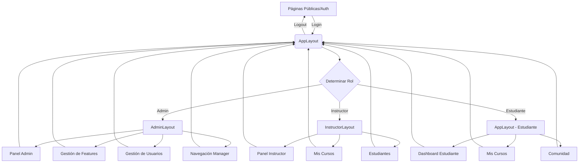

# Documento de Auditoría Estructurada v2 - Proyecto Nexo

**Fecha de Auditoría:** 2025-04-05

## 1. Resumen Ejecutivo y Estado General
### 1.1. Evaluación General
El proyecto Nexo se encuentra en una fase temprana de desarrollo (pre-alpha). La estructura básica está implementada con un enfoque en la arquitectura y navegación, pero la mayoría de las funcionalidades específicas están en estado incipiente o son placeholders. El proyecto tiene una base sólida en términos de estructura y sistema de diseño, pero carece de implementación funcional completa en la mayoría de los módulos.

### 1.2. Principales Funcionalidades **Visibles y Operativas**
- Sistema de navegación basado en roles (estructura básica implementada)
- Gestión de características/features (parcialmente implementada)
- Sistema de diseño básico con componentes shadcn/ui integrados
- Estructura de layouts por rol (Admin, Instructor, Estudiante)

### 1.3. Principales Funcionalidades **Faltantes o Incompletas**
- Sistema de autenticación funcional (solo estructura básica)
- Gestión de cursos y contenido educativo
- Sistema de mensajería y notificaciones (solo placeholders)
- Perfiles de usuario y gestión de roles avanzada
- Funcionalidades LMS específicas (evaluaciones, seguimiento de progreso)
- Analíticas y reportes

## 2. Estructura Visual y Navegación Principal
### 2.1. **Layouts Principales Identificados:**
- **AppLayout**: Layout principal para usuarios autenticados con sidebar y header. Estructura: Header superior, Sidebar lateral izquierda, y contenido principal.
- **AdminLayout**: Específico para administradores, con sidebar especializada y área de contenido. Estructura: Sidebar administrativa izquierda y área de contenido amplia a la derecha.
- **Layouts específicos por rol**: Estructura similar pero con navegación adaptada a cada rol (administrador, instructor, estudiante).

### 2.2. **Componente Header Principal:**
- **Descripción:** Header minimalista con logo de Nexo a la izquierda, toggle de sidebar, y acciones de usuario a la derecha (notificaciones, perfil, idioma).
- **Estado Funcional:** Parcial (la estructura básica existe pero muchas funcionalidades como notificaciones son placeholders).

### 2.3. **Componente Sidebar Principal:**
- **Descripción:** Sidebar vertical colapsable con navegación agrupada por categorías, iconos para cada elemento y badges para notificaciones/mensajes.
- **Estado Funcional:** Funcional (la estructura y colapso funcionan, pero muchos enlaces son placeholders).
- **¿Usa Navegación Dinámica de BD?** Parcialmente (existe estructura para ello en `useDynamicNavigation` pero parece fallback a navegación estática en muchos casos).

### 2.4. **Diagrama de Flujo de Navegación (Alto Nivel):**


### 2.5. **Menús de Navegación Detallados (Sidebar por Rol):**
- **Rol:** Admin
  - **Estructura Visual del Menú:**
    ```
    - Grupo: Dashboard 📊 (Activo)
      - Link: Visión General 🏠 (Activo)
      - Link: KPIs clave 📈 (Desactivado)
      - Link: Resumen de actividad reciente 🔔 (Desactivado)
      - Link: Alertas y notificaciones importantes 🔔 (Desactivado)
    - Grupo: Académico 🎓 (Activo)
      - Link: Gestión de cursos 📚 (Activo)
      - Link: Contenido Global 📄 (Desactivado)
      - Link: Categorías 🗂️ (Desactivado)
      - Link: Rutas de Aprendizaje 🛣️ (Desactivado)
      - Link: Certificados 🏆 (Desactivado)
      - Link: Analíticas Académicas 📊 (Desactivado)
    - Grupo: Gestión Central 👥 (Activo)
      - Link: Gestión de usuarios 👥 (Activo)
      - Link: Roles y permisos 🛡️ (Activo)
      - Link: Analíticas de usuarios 📊 (Desactivado)
      - Link: Comunicación 💬 (Desactivado)
    - Grupo: Finanzas 💰 (Activo/Placeholder)
      - Link: Transacciones 💳 (Desactivado)
      - Link: Suscripciones 📅 (Desactivado)
      - Link: Analíticas Financieras 📊 (Desactivado)
      - Link: Configuración de pagos ⚙️ (Desactivado)
    - Grupo: Sistema 🖥️ (Activo)
      - Link: Configuración General ⚙️ (Activo)
      - Link: Diseño 🎨 (Desactivado)
      - Link: Páginas CMS 📄 (Activo)
      - Link: Gestión de Features ✨ (Activo)
      - Link: Integraciones 🔌 (Desactivado)
      - Link: Analíticas de Plataforma 📊 (Desactivado)
      - Link: Salud/Logs 📊 (Desactivado)
    - Grupo: Herramientas Dev 🛠️ (Activo)
      - Link: Diagrama de navegación 🧭 (Activo)
      - Link: Revisión de elementos ✓ (Activo)
      - Link: Revisión de huérfanos 📚 (Activo)
      - Link: Herramientas de desarrollo 🛠️ (Activo)
      - Link: Configuraciones avanzadas ⚙️ (Desactivado)
    ```
  - **¿Coherente con NAVIGATION.md?** Sí

- **Rol:** Instructor
  - **Estructura Visual del Menú:**
    ```
    - Grupo: Dashboard 📊 (Activo)
      - Link: Panel Instructor 🏠 (Activo)
      - Link: Resumen de actividad reciente 📊 (Desactivado)
      - Link: Métricas de cursos 📈 (Desactivado)
      - Link: Próximas sesiones 📅 (Desactivado)
      - Link: Notificaciones importantes 🔔 (Desactivado)
    - Grupo: Gestión Académica 📚 (Activo)
      - Link: Mis Cursos 📚 (Activo)
      - Link: Crear Curso 📝 (Activo)
      - Link: Biblioteca de Contenido 📄 (Desactivado)
    - Grupo: Participantes 👥 (Activo)
      - Link: Mis Participantes 👥 (Activo)
      - Link: Progreso/Retroalimentación 📊 (Desactivado)
      - Link: Comunicación 💬 (Desactivado)
    - Grupo: Rendimiento 📈 (Activo/Placeholder)
      - Link: Analíticas de Cursos 📊 (Desactivado)
    - Grupo: Extras 🌐 (Activo/Placeholder)
      - Link: Comunidad 👥 (Activo)
      - Link: Calendario 📅 (Activo)
      - Link: Mensajes 💬 (Activo)
      - Link: Certificados 🏆 (Activo)
    - Grupo: Cuenta 👤 (Activo)
      - Link: Mi Perfil 👤 (Activo)
      - Link: Mi Facturación 💰 (Desactivado)
      - Link: Centro de Ayuda ❓ (Activo)
      - Link: Configuración ⚙️ (Activo)
    ```
  - **¿Coherente con NAVIGATION.md?** Sí

- **Rol:** Estudiante/Participante
  - **Estructura Visual del Menú:**
    ```
    - Grupo: Dashboard 📊 (Activo)
      - Link: Mi Panel 🏠 (Activo)
      - Link: Resumen de actividad 📊 (Desactivado)
      - Link: Próximas entregas 📅 (Desactivado)
      - Link: Recomendaciones 💖 (Desactivado)
      - Link: Notificaciones 🔔 (Activo)
    - Grupo: Comunidad 👥 (Activo)
      - Link: Feed 👥 (Activo)
      - Link: Leaderboard 🏆 (Desactivado)
      - Link: Mensajes 💬 (Activo)
      - Link: Notificaciones 🔔 (Activo)
    - Grupo: Aprendizaje 📚 (Activo)
      - Link: Mis Cursos 📚 (Activo/Destacado)
      - Link: Explorar Cursos 🧭 (Activo)
      - Link: Rutas de Aprendizaje 📈 (Activo)
      - Link: Calendario 📅 (Activo)
    - Grupo: Mi Cuenta 👤 (Activo)
      - Link: Mi Perfil 👤 (Activo)
      - Link: Certificados 🏆 (Activo)
      - Link: Facturación/Participaciones 💰 (Desactivado)
      - Link: Configuración ⚙️ (Activo)
    - Grupo: Ayuda ❓ (Activo)
      - Link: Centro de Ayuda ❓ (Activo)
      - Link: Contactar Soporte 📨 (Desactivado)
    ```
  - **¿Coherente con NAVIGATION.md?** Sí

### 2.6. **Módulo de Gestión de Navegación Admin (`/app/admin/navigation-manager`):**
- **Estado Funcional Percibido:** Parcial (la página existe pero sus capacidades completas son desconocidas)
- **Capacidades Clave Operativas:** Desconocido (no se puede determinar si tiene drag & drop, edición en vivo, o guardado funcional)

## 3. Inventario de Páginas Creadas y Funcionalidad

### 3.1. **Listado de Páginas Principales:**

- **Ruta (URL):** `/app/admin/features`
  - **Propósito Principal:** Gestión de características/features del sistema
  - **Estado Funcional Percibido:** Renderiza Parcial (la estructura está presente pero funcionalidad completa desconocida)
  - **Elementos Visuales Clave Presentes:** Tabla de características con filtros y acciones, drawer para edición
  - **¿Conectada a Datos Reales (Supabase)?** Parcialmente (parece tener estructura para ello)
  - **¿Sigue el Sistema de Diseño?** Sí

- **Ruta (URL):** `/app/admin/dashboard`
  - **Propósito Principal:** Dashboard principal del administrador
  - **Estado Funcional Percibido:** Renderiza (estructura básica presente)
  - **Elementos Visuales Clave Presentes:** Panel de control, posiblemente widgets estadísticos
  - **¿Conectada a Datos Reales (Supabase)?** Desconocido
  - **¿Sigue el Sistema de Diseño?** Mayormente

- **Ruta (URL):** `/app/admin/users`
  - **Propósito Principal:** Gestión de usuarios del sistema
  - **Estado Funcional Percibido:** Renderiza Parcial (vista de tabla implementada, funcionalidades CRUD desconocidas)
  - **Elementos Visuales Clave Presentes:** Tabla de usuarios con filtros y acciones
  - **¿Conectada a Datos Reales (Supabase)?** Parcialmente
  - **¿Sigue el Sistema de Diseño?** Sí

- **Ruta (URL):** `/app/admin/navigation-manager`
  - **Propósito Principal:** Administración de la navegación del sistema
  - **Estado Funcional Percibido:** Renderiza (nivel de funcionalidad desconocido)
  - **Elementos Visuales Clave Presentes:** Probablemente una interfaz de gestión de navegación
  - **¿Conectada a Datos Reales (Supabase)?** Probablemente (debería conectar con tabla navigation_items)
  - **¿Sigue el Sistema de Diseño?** Mayormente

- **Ruta (URL):** `/app/admin/courses`
  - **Propósito Principal:** Gestión de cursos del sistema
  - **Estado Funcional Percibido:** Renderiza (funcionalidad desconocida)
  - **Elementos Visuales Clave Presentes:** Probablemente una tabla o grid de cursos
  - **¿Conectada a Datos Reales (Supabase)?** Desconocido
  - **¿Sigue el Sistema de Diseño?** Mayormente

- **Ruta (URL):** `/app/instructor/dashboard`
  - **Propósito Principal:** Dashboard del instructor
  - **Estado Funcional Percibido:** Renderiza (funcionalidad desconocida)
  - **Elementos Visuales Clave Presentes:** Dashboard con métricas de instructor
  - **¿Conectada a Datos Reales (Supabase)?** Desconocido
  - **¿Sigue el Sistema de Diseño?** Mayormente

- **Ruta (URL):** `/app/instructor/courses`
  - **Propósito Principal:** Gestión de cursos del instructor
  - **Estado Funcional Percibido:** Renderiza (funcionalidad desconocida)
  - **Elementos Visuales Clave Presentes:** Lista o grid de cursos del instructor
  - **¿Conectada a Datos Reales (Supabase)?** Desconocido
  - **¿Sigue el Sistema de Diseño?** Mayormente

- **Ruta (URL):** `/app/dashboard`
  - **Propósito Principal:** Dashboard del estudiante
  - **Estado Funcional Percibido:** Renderiza (funcionalidad desconocida)
  - **Elementos Visuales Clave Presentes:** Dashboard con cursos activos y progreso
  - **¿Conectada a Datos Reales (Supabase)?** Desconocido
  - **¿Sigue el Sistema de Diseño?** Mayormente

- **Ruta (URL):** `/app/my-courses`
  - **Propósito Principal:** Visualización de cursos del estudiante
  - **Estado Funcional Percibido:** Renderiza (funcionalidad desconocida)
  - **Elementos Visuales Clave Presentes:** Lista o grid de cursos inscritos
  - **¿Conectada a Datos Reales (Supabase)?** Desconocido
  - **¿Sigue el Sistema de Diseño?** Mayormente

## 4. Componentes UI Clave y Sistema de Diseño

### 4.1. **Componentes Propios Reutilizables:**

- **Nombre y Ubicación:** `SidebarMainNavigation` en `src/components/layout/sidebar/navigation/SidebarMainNavigation.tsx`
  - **Descripción Visual:** Componente complejo de navegación que renderiza grupos de menú con ítems anidados, iconos y badges de notificación según el rol del usuario.
  - **Estado Percibido:** Funcional (la estructura básica está implementada pero algunos enlaces son placeholders)

- **Nombre y Ubicación:** `FeatureDrawer` en `src/components/features/FeatureDrawer.tsx`
  - **Descripción Visual:** Panel lateral deslizable para edición de características con formulario dinámico.
  - **Estado Percibido:** Parcial (la estructura existe pero faltan detalles de integración completa)

- **Nombre y Ubicación:** `ConditionalSidebar` en `src/components/layout/ConditionalSidebar.tsx`
  - **Descripción Visual:** Componente contenedor que muestra la navegación correspondiente basada en el rol del usuario, con soporte para colapsar/expandir y selector de idioma/rol.
  - **Estado Percibido:** Funcional (estructura e integración básica implementada)

- **Nombre y Ubicación:** `SidebarNavGroup` en `src/components/layout/sidebar/navigation/SidebarNavGroup.tsx`
  - **Descripción Visual:** Grupo colapsable de navegación con título, icono y elementos anidados.
  - **Estado Percibido:** Funcional

- **Nombre y Ubicación:** `AdminPageLayout` en `src/layouts/AdminPageLayout.tsx`
  - **Descripción Visual:** Layout para páginas administrativas con encabezado, subtítulo, botón de retorno, y área para pestañas.
  - **Estado Percibido:** Funcional

### 4.2. **Adherencia General al `DESIGN_SYSTEM.md`:**
- **Evaluación:** Media-Alta
- **Observaciones:** El proyecto utiliza shadcn/ui de manera consistente, y los componentes personalizados siguen las clases de Tailwind establecidas. La paleta de colores y sistema de espaciado parecen coherentes en los componentes visualizados.

### 4.3. **Estado de Storybook:**
- **¿Instalado y Configurado?** No (no se detectan archivos de storybook)
- **¿Historias de Ejemplo Creadas?** No

## 5. Funcionalidades Principales Implementadas (Detalle)

### 5.1. **Inventario Detallado:**

- **Nombre Funcionalidad:** Sistema de Navegación por Roles
  - **Estado Detallado:** Estructura implementada con navegación estática y soporte parcial para navegación dinámica desde BD. La mayoría de los enlaces son placeholders pero la estructura visual funciona.
  - **Principales Componentes/Páginas Involucradas:** `ConditionalSidebar`, `SidebarMainNavigation`, `SidebarNavGroup`, `NavigationManager`
  - **Flujo de Usuario Básico Operativo?** Parcial (la navegación visual funciona pero muchos destinos son placeholders)

- **Nombre Funcionalidad:** Gestión de Features/Características
  - **Estado Detallado:** Implementación parcial con tabla de features, filtros, y drawer para edición. No está claro el nivel de integración con backend.
  - **Principales Componentes/Páginas Involucradas:** `FeatureManagement`, `FeaturesTable`, `FeatureDrawer`
  - **Flujo de Usuario Básico Operativo?** Parcial (la UI está implementada pero funcionalidad completa desconocida)

- **Nombre Funcionalidad:** Autenticación y Gestión de Roles
  - **Estado Detallado:** Estructura básica implementada con contextos de autenticación y roles, pero sin confirmación de integración completa con Supabase Auth.
  - **Principales Componentes/Páginas Involucradas:** `AuthContext`, `useAuth`, layouts específicos por rol
  - **Flujo de Usuario Básico Operativo?** Parcial (estructura presente pero integración completa desconocida)

- **Nombre Funcionalidad:** Cambio de Idioma
  - **Estado Detallado:** Interfaz básica implementada en el Sidebar con selector de idiomas (español, inglés, portugués)
  - **Principales Componentes/Páginas Involucradas:** `SidebarFooterSection`, `useSidebarNavigation`
  - **Flujo de Usuario Básico Operativo?** Parcial (interfaz visual presente pero funcionalidad real desconocida)

## 6. Base Tecnológica y Backend (Resumen)

### 6.1. **Stack Confirmado:**
- Frontend: React con TypeScript
- Routing: React Router
- Estilos: Tailwind CSS
- Componentes UI: shadcn/ui
- Iconos: lucide-react
- Backend: Supabase (aparente)
- Estado: Contextos React, posiblemente React Query

### 6.2. **Interacción con Supabase:**
- Cliente JS instalado y configurado
- Estructura para RLS presente pero implementación completa desconocida
- Posible uso de Edge Functions pero no confirmado en el código revisado

## 7. Testing y Calidad (Percepción)

### 7.1. **Presencia de Pruebas:**
Ninguna o Pocas (no se detectan archivos de prueba significativos)

### 7.2. **Tipos de Pruebas Detectadas:**
No Determinado (no se identifican claramente archivos de prueba)

## 8. Identificación de Gaps y Desviaciones Principales

1. **Funcionalidades LMS Incompletas**: A pesar de ser un sistema de aprendizaje, las funcionalidades específicas de LMS (visualización de cursos, seguimiento de progreso, evaluaciones) están mayormente ausentes o son placeholders.

2. **Implementación Backend Parcial**: La estructura para conectar con Supabase existe, pero no hay evidencia clara de que todas las funcionalidades estén completamente conectadas a datos reales.

3. **Autenticación No Integrada Completamente**: Existe la estructura para autenticación pero no está claro su nivel de integración real con Supabase Auth y flujos completos.

4. **Sistema de Notificaciones y Mensajería No Implementado**: A pesar de estar en la navegación, estos sistemas parecen ser puramente placeholders sin funcionalidad real.

5. **Analíticas y Reportes Ausentes**: No se detecta implementación real de sistemas de analíticas y reportes más allá de posibles estructuras básicas UI.

## 9. Conclusiones y Siguientes Pasos Sugeridos

### 9.1. Resumen del Estado Funcional y Visual
El proyecto Nexo se encuentra en una fase inicial con una arquitectura base sólida y un sistema de navegación bien estructurado. La implementación visual está avanzada siguiendo patrones de diseño coherentes con shadcn/ui y Tailwind, pero la funcionalidad real está limitada principalmente a la navegación y estructuras básicas. La mayoría de las funcionalidades específicas están en estado de placeholder o implementadas parcialmente sin conexión clara a datos reales.

### 9.2. Sugerencias para trabajo inmediato
1. **Completar autenticación**: Implementar y conectar completamente el sistema de autenticación con Supabase Auth para habilitar funcionalidades protegidas.

2. **Implementar funcionalidad LMS básica**: Priorizar la implementación de al menos un flujo completo de visualización de cursos para estudiantes y gestión de cursos básica para instructores.

3. **Conectar componentes UI con datos reales**: Completar la integración de los componentes UI existentes (especialmente tablas y formularios) con datos reales de Supabase.

4. **Implementar módulo de gestión de usuarios completo**: Completar la funcionalidad CRUD para usuarios y roles que parece estar parcialmente implementada.

5. **Documentar componentes**: Implementar Storybook o documentación equivalente para los componentes UI clave que ya están desarrollados.
