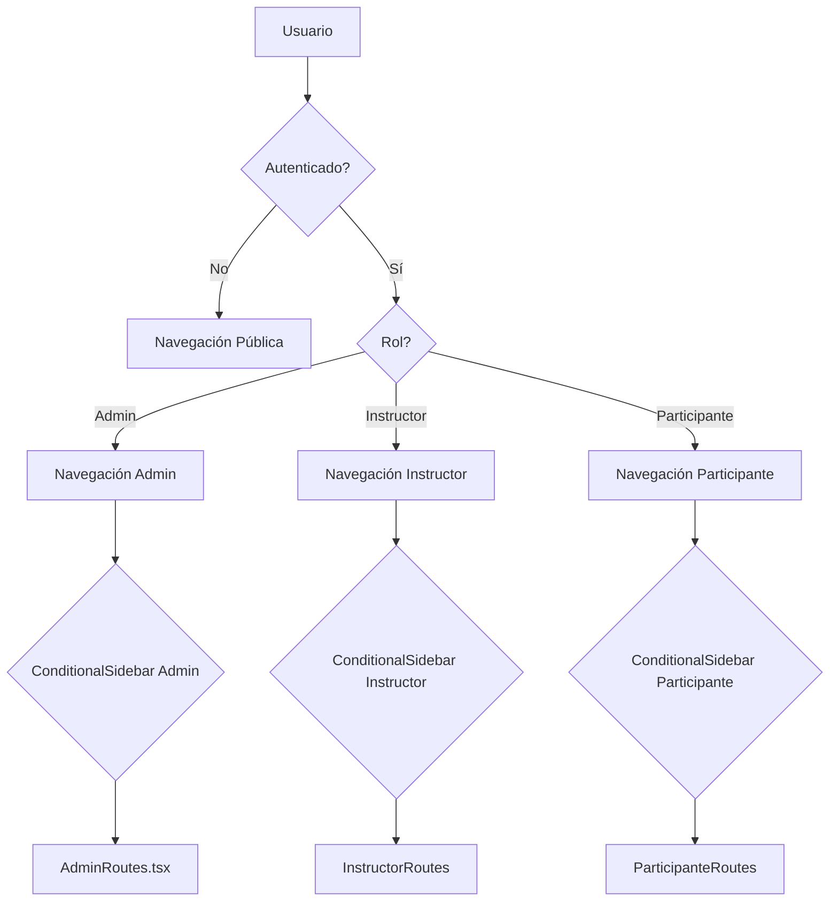

# Informe de Estado Funcional y Visual v5 - Proyecto Nexo

**Fecha del Informe:** 2025-04-05

## 1. Resumen Ejecutivo y Estado General

### 1.1. Evaluación General (Madurez, Coherencia)

El proyecto Nexo se encuentra en una fase de desarrollo temprana a intermedia, con estructuras fundamentales establecidas pero varios componentes en estado de `Placeholder` o parcialmente implementados. La coherencia visual y estructural es `⚠️ Media`, con áreas bien definidas siguiendo patrones consistentes (especialmente en componentes de navegación) y otras áreas que requieren mayor desarrollo para mantener la consistencia.

### 1.2. Principales `Funcionalidades Transversales` y `Páginas` Visibles y Operativas

| Funcionalidades/Páginas | Estado | Observaciones |
|------------------------|--------|--------------|
| Sistema Base de Navegación | ✅ Funcional | El sistema de navegación condicional basado en roles está implementado |
| Panel de Administración | ⚠️ Parcial | Estructura básica presente con algunas funciones operativas |
| Gestión de Navegación | ✅ Funcional | Permite configurar elementos de navegación por rol |
| Sistema de Roles | ⚠️ Parcial | Funcionalidad básica de cambio de roles implementada |
| Dashboard Administrativo | 🚧 Placeholder | Estructura visible sin funcionalidad completa |

### 1.3. Principales `Funcionalidades Transversales` y `Páginas` Faltantes o Incompletas (vs. Roadmap/Requisitos)

| Funcionalidad/Página | Estado | Detalle |
|---------------------|--------|---------|
| `Breadcrumbs` | 🚧 En desarrollo | Mencionado en el manifiesto de navegación como "planned" |
| Navegación móvil avanzada | 🚧 En desarrollo | Indicada en NAVIGATION.md como en desarrollo |
| Personalización por usuario | ⏳ Planificado | Mencionada en NAVIGATION.md como planificada |
| Páginas de estudiante/participante | 🤔 No determinado | No se detectan implementaciones completas |
| Sistema multi-idioma | ⚠️ Parcial | Infraestructura básica presente, implementación incompleta |

## 2. Estructura Visual y `Elementos de Navegación Global`

### 2.1. **`Layouts` Principales Identificados**

| Layout | Propósito | Estado |
|--------|----------|--------|
| `AppLayout` | Layout principal para usuarios autenticados | ✅ Funcional |
| `AdminLayout` | Variante para administradores | ⚠️ Parcial |
| `AuthLayout` | Para páginas de autenticación | 🤔 No determinado |

### 2.2. **`Header` (Cabecera Principal)**

* `Estado Funcional:` ✅ Funcional
* `Descripción Visual y Elementos Clave:`

| Elemento | Estado Funcional |
|----------|-----------------|
| Logo | ✅ Funcional |
| HeaderActions | ✅ Funcional |
| UserMenu | ✅ Funcional |
| RoleIndicator | ✅ Funcional |

* `Adherencia al Diseño:` ✅ Alta

### 2.3. **`Sidebar` (Barra Lateral Principal)**

* `Estado Funcional:` ✅ Funcional
* `Descripción Visual:` Barra lateral colapsable con transiciones animadas, compatible con versión móvil, grupos de navegación expandibles.
* `¿Usa Navegación Dinámica de BD?` ✅ Sí, implementado a través del hook `useDynamicNavigation` que consulta la tabla `navigation_items` en Supabase.
* `Adherencia al Diseño:` ✅ Alta (sigue los patrones definidos en el manifiesto de navegación)

### 2.4. **`Footer` (Pie de Página Global)**

* `Estado Funcional:` 🚧 Placeholder
* `Elementos Presentes:` No se identifica implementación concreta del Footer global.
* `Adherencia al Diseño:` 🤔 No determinado

### 2.5. **`Sidebar Footer`**

* `Estado Funcional:` ✅ Funcional
* `Elementos Presentes y Estado:`

| Elemento | Estado Funcional |
|----------|-----------------|
| Selector de Idioma | ✅ Funcional |
| Botón de Configuración | ✅ Funcional |
| Botón de Cierre de Sesión | ✅ Funcional |
| RoleSwitcher | ✅ Funcional |

* `Adherencia al Diseño:` ✅ Alta (conforme a las especificaciones en `NAVIGATION.md`)

### 2.6. **Otros `Elementos de Navegación Globales`**

No se identifican otros elementos de navegación globales implementados. El `Breadcrumbs` está planificado pero no implementado.

### 2.7. **Diagrama de Flujo de Navegación (Alto Nivel)**

### 2.8. **Menús Detallados (`Sidebar` por Rol)**

**Admin:**

| Tipo | Nombre Visible | Icono | Estado | Destino/Acción |
|------|---------------|------|--------|---------------|
| Grupo | Dashboard | LayoutDashboard | Activo | - |
| Enlace | Visión General | - | Activo | /app/admin/dashboard |
| Grupo | Académico | BookOpen | Activo | - |
| Enlace | Gestión de cursos | - | Activo | /app/admin/courses |
| Enlace | Analíticas Académicas | - | Placeholder | - |
| Grupo | Comunidad | Users | Activo | - |
| Enlace | Gestión de usuarios | - | Activo | /app/admin/users |
| Enlace | Roles y permisos | - | Activo | /app/admin/roles |
| Grupo | Sistema | Settings | Activo | - |
| Enlace | Configuración General | - | Activo | /app/admin/settings |
| Enlace | Páginas CMS | - | Activo | /app/admin/system-pages |
| Enlace | Gestión de Features | - | Activo | /app/admin/features |
| Grupo | Herramientas Dev | Code | Activo | - |
| Enlace | Diagrama de navegación | - | Activo | /app/admin/navigation-diagram |
| Enlace | Revisión de elementos | - | Activo | /app/admin/review-elements |
| Enlace | Gestión de Navegación | - | Activo | /app/admin/navigation-manager |

**Instructor:**

| Tipo | Nombre Visible | Icono | Estado | Destino/Acción |
|------|---------------|------|--------|---------------|
| Grupo | Dashboard | LayoutDashboard | Activo | - |
| Enlace | Panel Instructor | - | Activo | /app/instructor/dashboard |
| Grupo | Gestión Académica | BookOpen | Activo | - |
| Enlace | Mis Cursos | - | Activo | /app/instructor/courses |
| Grupo | Comunidad | Users | Activo | - |
| Enlace | Mis Participantes | - | Placeholder | - |
| Grupo | Mi Cuenta | User | Activo | - |
| Enlace | Mi Perfil | - | Placeholder | - |

**Estudiante/Participante:**

| Tipo | Nombre Visible | Icono | Estado | Destino/Acción |
|------|---------------|------|--------|---------------|
| Grupo | Dashboard | LayoutDashboard | Activo | - |
| Enlace | Mi Panel | - | Activo | /app/dashboard |
| Grupo | Comunidad | Users | Activo | - |
| Enlace | Feed | - | Placeholder | - |
| Grupo | Aprendizaje | BookOpen | Activo | - |
| Enlace | Mis Cursos | - | Activo | /app/my-courses |
| Enlace | Explorar Cursos | - | Activo | /app/explore-courses |
| Grupo | Mi Cuenta | User | Activo | - |
| Enlace | Mi Perfil | - | Placeholder | - |

### 2.9. **Módulo de Gestión de Navegación Admin**

`Estado Funcional:` ✅ Funcional

El módulo de gestión de navegación para administradores está implementado a través del componente `NavigationManager` y provee las siguientes capacidades:
- Gestión de elementos de navegación por rol
- Configuración visual de la estructura de navegación
- Integración con la base de datos para almacenar configuraciones de navegación
- Visualización de navegación condicional según rol

## 3. Desglose Funcional por `Página` Principal

### **`Página:` `/app/admin/dashboard` - Panel de Control Administrativo**

**Estado General Página:** 🚧 Placeholder
**Adherencia Diseño (`Layout` General):** ✅ Alta

**`Widgets Funcionales` Presentes:**

| `Widget Funcional` | Propósito | Estado Funcional ⚙️ | Conexión DB 💾 | Adherencia Diseño ✨ | Observaciones |
|-------------------|----------|------------------|--------------|--------------------|--------------|
| RoleDebugger | Muestra info del rol actual | ✅ Funcional | ✅ Sí | ✅ Alta | Componente de desarrollo |
| StatsSection | Mostrar KPIs clave | 🚧 Placeholder | ❌ No | ✅ Alta | Usa datos mock |
| WelcomeSection | Bienvenida personalizada | 🚧 Placeholder | ❌ No | ✅ Alta | - |

### **`Página:` `/app/admin/navigation-manager` - Gestión de Navegación**

**Estado General Página:** ✅ Funcional
**Adherencia Diseño (`Layout` General):** ✅ Alta

**`Widgets Funcionales` Presentes:**

| `Widget Funcional` | Propósito | Estado Funcional ⚙️ | Conexión DB 💾 | Adherencia Diseño ✨ | Observaciones |
|-------------------|----------|------------------|--------------|--------------------|--------------|
| NavigationManager | Gestionar elementos de navegación | ✅ Funcional | ✅ Sí | ✅ Alta | Conexión a tabla navigation_items |
| NavigationTreeView | Visualizar jerarquía de navegación | ✅ Funcional | ✅ Sí | ✅ Alta | - |
| NavigationRoleEditor | Editar permisos por rol | ✅ Funcional | ✅ Sí | ✅ Alta | - |

### **`Página:` `/app/admin/features` - Gestión de Características**

**Estado General Página:** ✅ Funcional
**Adherencia Diseño (`Layout` General):** ✅ Alta

**`Widgets Funcionales` Presentes:**

| `Widget Funcional` | Propósito | Estado Funcional ⚙️ | Conexión DB 💾 | Adherencia Diseño ✨ | Observaciones |
|-------------------|----------|------------------|--------------|--------------------|--------------|
| FeatureManagement | Gestionar features flags | ✅ Funcional | ✅ Sí | ✅ Alta | - |
| FeatureAccordionGroup | Agrupar características | ✅ Funcional | ✅ Sí | ✅ Alta | - |
| PlatformFeaturesAccordion | Mostrar features de plataforma | ✅ Funcional | ✅ Sí | ✅ Alta | - |

### **`Página:` `/app/admin/system-pages` - Gestión de Páginas del Sistema**

**Estado General Página:** ✅ Funcional
**Adherencia Diseño (`Layout` General):** ✅ Alta

**`Widgets Funcionales` Presentes:**

| `Widget Funcional` | Propósito | Estado Funcional ⚙️ | Conexión DB 💾 | Adherencia Diseño ✨ | Observaciones |
|-------------------|----------|------------------|--------------|--------------------|--------------|
| PageManagement | Gestionar páginas del sistema | ✅ Funcional | ✅ Sí | ✅ Alta | - |
| PageEditorDialog | Editar contenido de páginas | ✅ Funcional | ✅ Sí | ✅ Alta | - |
| AIPageCreator | Crear páginas con IA | ⚠️ Parcial | ✅ Sí | ✅ Alta | Funcionalidad en desarrollo |

### **`Página:` `/app/admin/users` - Gestión de Usuarios**

**Estado General Página:** ⚠️ Parcial
**Adherencia Diseño (`Layout` General):** ✅ Alta

**`Widgets Funcionales` Presentes:**

| `Widget Funcional` | Propósito | Estado Funcional ⚙️ | Conexión DB 💾 | Adherencia Diseño ✨ | Observaciones |
|-------------------|----------|------------------|--------------|--------------------|--------------|
| UserRoleEditor | Editar roles de usuarios | ⚠️ Parcial | ✅ Sí | ✅ Alta | - |
| UserRoleSearch | Buscar usuarios | ⚠️ Parcial | ✅ Sí | ✅ Alta | - |
| UserSearchResults | Mostrar resultados de búsqueda | ⚠️ Parcial | ✅ Sí | ✅ Alta | - |

### **`Página:` `/app/admin/roles` - Gestión de Roles**

**Estado General Página:** ⚠️ Parcial
**Adherencia Diseño (`Layout` General):** ✅ Alta

**`Widgets Funcionales` Presentes:**

| `Widget Funcional` | Propósito | Estado Funcional ⚙️ | Conexión DB 💾 | Adherencia Diseño ✨ | Observaciones |
|-------------------|----------|------------------|--------------|--------------------|--------------|
| RoleManagementSearch | Buscar roles | ⚠️ Parcial | ✅ Sí | ✅ Alta | - |
| UserRolesTable | Visualizar roles de usuarios | ⚠️ Parcial | ✅ Sí | ✅ Alta | - |

### **`Página:` `/app/dashboard` - Dashboard de Participante**

**Estado General Página:** 🚧 Placeholder
**Adherencia Diseño (`Layout` General):** ✅ Alta

**`Widgets Funcionales` Presentes:**

| `Widget Funcional` | Propósito | Estado Funcional ⚙️ | Conexión DB 💾 | Adherencia Diseño ✨ | Observaciones |
|-------------------|----------|------------------|--------------|--------------------|--------------|
| CoursesWidget | Mostrar cursos del usuario | 🚧 Placeholder | ❌ No | ✅ Alta | Usa datos mock |
| DashboardWidgetArea | Área para widgets | 🚧 Placeholder | ❌ No | ✅ Alta | - |

## 4. Inventario de `Páginas` (Resumen)

### 4.1. `Páginas` Visibles en Menús

| Ruta | Propósito | Rol(es) | Estado Página 👁️ |
|------|----------|---------|-----------------|
| /app/admin/dashboard | Panel de control admin | Admin | 🚧 Placeholder |
| /app/admin/users | Gestión de usuarios | Admin | ⚠️ Parcial |
| /app/admin/courses | Gestión de cursos | Admin | 🚧 Placeholder |
| /app/admin/system-pages | Gestión de páginas | Admin | ✅ Funcional |
| /app/admin/features | Gestión de features | Admin | ✅ Funcional |
| /app/admin/navigation-manager | Gestión de navegación | Admin | ✅ Funcional |
| /app/admin/navigation-diagram | Diagrama navegación | Admin | 🚧 Placeholder |
| /app/admin/roles | Gestión de roles | Admin | ⚠️ Parcial |
| /app/instructor/dashboard | Panel de instructor | Instructor | 🚧 Placeholder |
| /app/instructor/courses | Gestión de cursos instructor | Instructor | 🚧 Placeholder |
| /app/dashboard | Panel de participante | Participante | 🚧 Placeholder |
| /app/my-courses | Cursos del participante | Participante | 🚧 Placeholder |
| /app/explore-courses | Exploración de cursos | Participante | 🚧 Placeholder |

### 4.2. `Páginas` Huérfanas

| Ruta | Propósito | Rol(es) | Estado Página 👁️ |
|------|----------|---------|-----------------|
| /app/admin/orphan-review | Revisión de elementos huérfanos | Admin | 🚧 Placeholder |
| /app/admin/development | Herramientas desarrollo | Admin | 🚧 Placeholder |
| /app/admin/settings/developer | Configuraciones avanzadas | Admin | 🚧 Placeholder |

### 4.3. `Páginas` de Sistema/No Visibles

| Ruta | Propósito | Rol(es) | Estado Página 👁️ |
|------|----------|---------|-----------------|
| /auth/login | Página de inicio de sesión | Público | 🤔 No determinado |
| /auth/register | Página de registro | Público | 🤔 No determinado |
| /auth/forgot-password | Recuperación de contraseña | Público | 🤔 No determinado |

## 5. `Componentes UI Base` Reutilizables Clave

| Componente y Ubicación 📍 | Descripción 🤔 | `Páginas`/`Widgets` Típicos 📄 | Estado Percibido ⚙️ | Diseño ✨ | Próximos Pasos ➡️ |
|--------------------------|---------------|------------------------------|-------------------|-----------|-----------------|
| SidebarNavGroup | Grupo colapsable de navegación | Sidebar | ✅ Funcional | ✅ Alta | Documentar variantes |
| AdminMenu | Menú administrativo | Páginas admin | ✅ Funcional | ✅ Alta | - |
| AdvancedDataTable | Tabla de datos avanzada | Páginas gestión | ✅ Funcional | ✅ Alta | - |
| Button (shadcn) | Botón estándar | Todas | ✅ Funcional | ✅ Alta | - |
| Dialog (shadcn) | Diálogo modal | Varias | ✅ Funcional | ✅ Alta | - |
| Card (shadcn) | Tarjeta contenedora | Varias | ✅ Funcional | ✅ Alta | - |

## 6. `Funcionalidades Transversales`

| Funcionalidad | ¿Implementada? | Detalles Clave | Estado |
|--------------|---------------|----------------|--------|
| Autenticación | ⚠️ Parcialmente | Framework presente pero implementación incompleta | ⚠️ Parcial |
| Sistema Multi-idioma | ⚠️ Parcialmente | Hook y componentes base presentes | ⚠️ Parcial |
| Role Switching | ✅ Sí | Implementado para usuarios admin | ✅ Funcional |
| Gestión de Temas | ✅ Sí | Soporte Claro/Oscuro | ✅ Funcional |
| Notificaciones Toast | ✅ Sí | Mediante librería sonner | ✅ Funcional |
| Feature Flags | ✅ Sí | Sistema completo con gestión | ✅ Funcional |
| Gestión Navegación Dinámica | ✅ Sí | Integración con DB | ✅ Funcional |

## 7. Patrones de Diseño UI Específicos (`Elementos de Navegación Interna`, `Componentes Emergentes`)

| Patrón/Componente | ¿Se Usa? | `Páginas`/`Widgets` Ejemplo | Funcionalidad UI | Estado | Diseño (Observaciones) |
|------------------|----------|----------------------------|-----------------|--------|------------------------|
| Tabs | ✅ Sí | AdminTabs | Navegación interna | ✅ Funcional | ✅ Alta |
| Accordion | ✅ Sí | FeatureAccordionGroup | Contenido colapsable | ✅ Funcional | ✅ Alta |
| Dialog | ✅ Sí | PageEditorDialog | Contenido modal | ✅ Funcional | ✅ Alta |
| Dropdown Menu | ✅ Sí | UserMenu | Menú desplegable | ✅ Funcional | ✅ Alta |
| Popover | ✅ Sí | TooltipContent | Información emergente | ✅ Funcional | ✅ Alta |

## 8. Otras Observaciones Relevantes

- El proyecto tiene una arquitectura clara y bien organizada, con separación de responsabilidades.
- La documentación SSOT está bastante completa y alineada con la implementación.
- El sistema de navegación es el componente más maduro y completo del proyecto.
- Se observa un enfoque feature-first en la organización del código.
- Falta desarrollo en las páginas principales de cara al usuario final (participante).

## 9. Base Tecnológica y Backend (Confirmación)

### 9.1. Stack Confirmado

- Frontend: React + TypeScript + Vite
- Estilos: TailwindCSS + shadcn/ui
- Gestión de Estado: React Context API + React Query (TanStack)
- Enrutamiento: React Router
- UI Components: shadcn/ui (basado en Radix UI)
- Iconos: lucide-react

### 9.2. Interacción Backend (Cliente Supabase, RLS activas?, Edge Functions?)

- Cliente Supabase configurado y en uso
- Evidencia de consultas a tablas (navigation_items)
- RLS parece estar configurado para proteger datos
- No hay evidencia clara de Edge Functions en uso activo

## 10. Testing y Calidad (Percepción)

### 10.1. Presencia de Pruebas

Se detectan archivos de pruebas (*.test.tsx) mencionados en el manifiesto de navegación, pero no hay evidencia clara del nivel de cobertura.

### 10.2. Tipos Detectados

- Pruebas de componentes individuales (unit tests)
- Historias de Storybook para documentación visual de componentes

## 11. Identificación de Gaps y Desviaciones Principales vs. SSOT

1. **Implementación incompleta de Breadcrumbs:** Definido en NAVIGATION.md pero marcado como "planned", sin implementación visible.
2. **Navegación Móvil Avanzada:** Mencionada como "en desarrollo" pero su implementación parece básica.
3. **Páginas de Participante:** El rol más importante para usuarios finales tiene principalmente placeholders sin funcionalidad completa.
4. **Sistema Multi-idioma:** Infraestructura presente pero implementación parcial, a pesar de ser una funcionalidad transversal clave.
5. **Autenticación:** Framework presente pero implementación incompleta de flujos completos de autenticación y autorización.

## 12. Conclusiones y Siguientes Pasos Sugeridos (Tu Perspectiva IA)

### 12.1. Resumen del Estado Funcional y Visual Clave

El proyecto Nexo muestra una base arquitectónica sólida con un sistema de navegación robusto y bien implementado. La estructura de navegación condicional por roles funciona correctamente, y la gestión de características (feature flags) está bien desarrollada. Sin embargo, muchas páginas están en estado de placeholder, especialmente las orientadas al usuario final (participante), y algunas funcionalidades transversales importantes están parcialmente implementadas.

### 12.2. Sugerencias concretas sobre áreas de enfoque inmediato

1. **Completar funcionalidades de usuario final:** Priorizar el desarrollo de las páginas y widgets de participante para ofrecer valor inmediato a los usuarios finales.
2. **Implementar Breadcrumbs:** Esta característica mejoraría significativamente la navegabilidad y está definida en la SSOT pero no implementada.
3. **Mejorar navegación móvil:** La experiencia móvil necesita desarrollo adicional para cumplir con las expectativas modernas de responsividad.
4. **Completar sistema multi-idioma:** La infraestructura básica está presente, pero completar la implementación permitiría ampliar la accesibilidad.
5. **Consolidar flujos de autenticación:** Desarrollar completamente los flujos de registro, inicio de sesión y recuperación de contraseña.

---

## Anexo A: Glosario de Términos Clave y Leyenda

### Elementos de la Interfaz de Usuario (UI)

* **`Página` (o `Vista`):** Una pantalla principal de la aplicación asociada a una URL específica (ruta), que ocupa el área de contenido central y presenta información o funcionalidades al usuario.

* **`Layout`:** La estructura visual general que organiza los `Elementos de Navegación Global` y el área de contenido principal de una `Página`. Define la disposición general (dónde va el header, la sidebar, etc.).

* **`Elemento de Navegación Global`:** Componente UI persistente o semi-persistente que ayuda al usuario a orientarse y moverse entre las `Páginas` o secciones principales de la aplicación.
  * **`Header` (Cabecera):** Barra superior, generalmente con logo, acciones rápidas, menú de usuario.
  * **`Sidebar` (Barra Lateral):** El menú vertical con la estructura de navegación jerárquica principal, específica por rol y colapsable.
  * **`Grupo de Navegación (Sidebar)`:** Una sección dentro de la Sidebar que agrupa `Items de Navegación` relacionados.
  * **`Item de Navegación (Sidebar)`:** Un elemento individual dentro de un `Grupo de Navegación` o directamente en la Sidebar.
  * **`Footer` (Pie de Página Global):** Barra inferior común a la mayoría de las páginas con información legal, enlaces, etc.
  * **`Sidebar Footer` (Pie de Sidebar):** Sección inferior dentro de la `Sidebar` con acciones como idioma, tema, logout, cambio de rol.
  * **`Breadcrumbs` (Migas de Pan):** Indicador de ruta jerárquica de la página actual.

* **`Elemento de Navegación Interna de Página`:** Componentes UI utilizados dentro del área de contenido principal de una `Página` para organizar su contenido o permitir la navegación entre sub-secciones lógicas.
  * **`Tabs` (Pestañas):** Componente que muestra diferentes paneles de contenido dentro del mismo espacio de la página.
  * **`Stepper` (Pasos):** Componente que guía al usuario a través de un proceso de varios pasos.
  * **`Accordion` (Acordeón):** Componente que permite mostrar/ocultar secciones de contenido dentro de una página.
  * **`Menú Secundario / Submenú (Página)`:** Enlaces de navegación específicos de una `Página` o sección compleja.

* **`Componente Emergente / Overlay`:** Componentes UI que aparecen temporalmente sobre la interfaz principal.
  * **`Popover`:** Un pequeño cuadro de contenido no modal que aparece junto a su elemento disparador.
  * **`Dropdown Menu`:** Una lista de opciones o acciones que aparece al hacer clic en un botón o icono.
  * **`Tooltip`:** Un pequeño texto descriptivo que aparece al pasar el cursor sobre un elemento.

* **`Widget Funcional` (o `Módulo de Página`):** Un bloque o componente dentro de una `Página` que encapsula una funcionalidad específica y autocontenida.

* **`Componente UI Base` (o `Componente de Diseño`):** Bloque de construcción fundamental y reutilizable de la interfaz, definido por el `DESIGN_SYSTEM.md`.

### Términos de Estado y Calidad (Usados en Auditorías)

* **`Estado Percibido (Indicadores):`**
  * `✅ Funcional:` Parece completo y operativo según su propósito definido.
  * `⚠️ Parcial:` Implementado en parte, con limitaciones o funcionalidades clave faltantes.
  * `🚧 Placeholder:` Existe la estructura/UI básica, pero sin lógica funcional o con datos mock.
  * `❌ Con Errores:` Se detectan problemas claros, no funciona como se espera o causa fallos.
  * `🤔 Desconocido/No Determinado:` No se pudo evaluar el estado con la información disponible.

* **`Conexión DB (Indicadores):`**
  * `✅ Sí:` Parece estar obteniendo/guardando datos reales de Supabase correctamente.
  * `⚠️ Parcialmente:` Usa una mezcla de datos reales y mock, o la conexión es incompleta.
  * `❌ No:` No hay conexión aparente a datos reales; usa solo datos mock o está vacío.
  * `💾 N/A:` No aplica (ej. componente puramente visual, página estática).

* **`Diseño (Indicadores):`**
  * `✅ Alta:` Sigue fielmente el `DESIGN_SYSTEM.md` (colores, espaciado, tipo, componentes).
  * `⚠️ Media:` Sigue el Design System en general, pero presenta algunas inconsistencias menores.
  * `❌ Baja:` Se desvía notablemente del Design System o tiene problemas visuales evidentes.
  * `✨ N/A:` No aplica (ej. funcionalidad puramente lógica).
